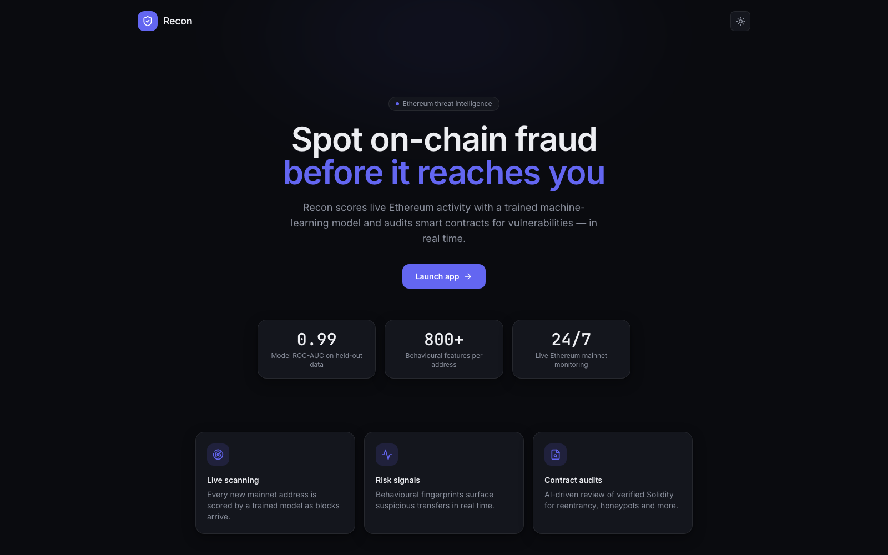
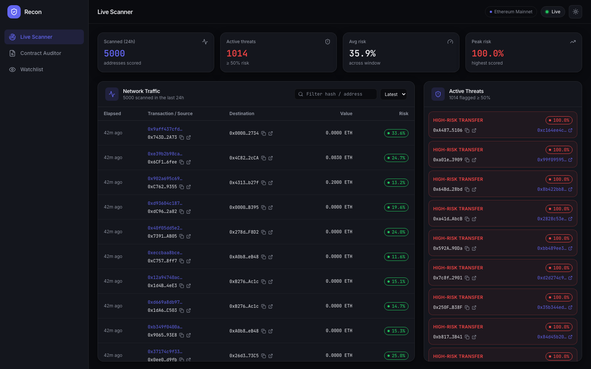
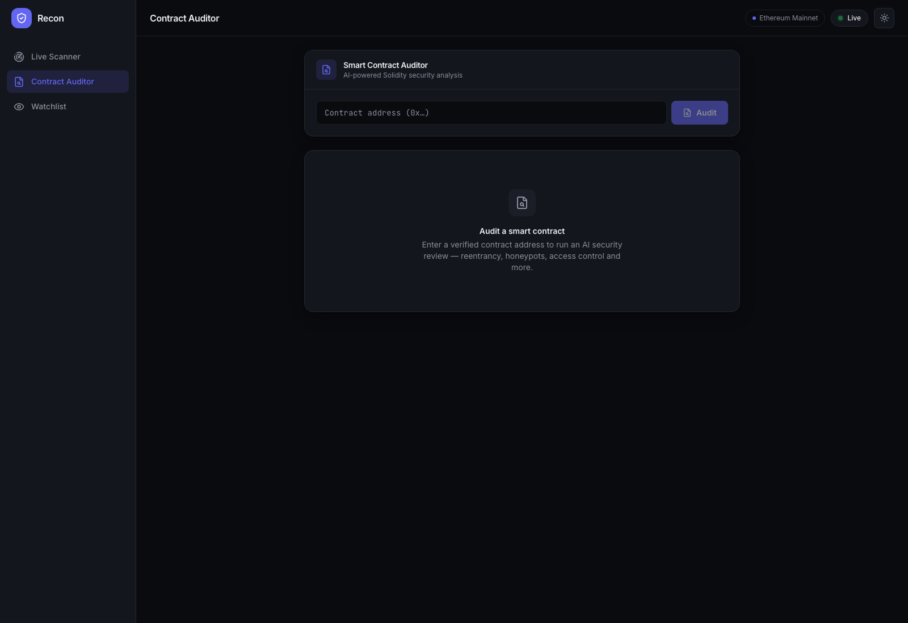

<div align="center">

# 🛡️ Recon

### Real-time Ethereum threat intelligence — ML fraud scoring + AI smart contract auditing

[](https://opensource.org/licenses/MIT)
[](https://www.python.org/downloads/)
[](https://react.dev/)
[](https://fastapi.tiangolo.com/)
[](https://docs.docker.com/compose/)

**[recon-security.xyz](https://recon-security.xyz)** • **[Demo Video](https://youtu.be/5ofxkW9tX0w)** • **[Report a Bug](https://github.com/amapara27/recon-ethereum-security/issues)**

</div>



---

## What it is

Recon watches Ethereum mainnet as blocks are produced, scores every newly-seen
address with a trained fraud model, and separately audits verified Solidity
source with an LLM.

Two things are happening independently:

**1. Live fraud scoring.** A `monitor` process subscribes to new blocks over
Web3. For each address it hasn't seen before, it pulls that address's full ETH
and ERC-20 transaction history from Etherscan, turns it into an **814-column
behavioural fingerprint** (transaction cadence, counterparty spread, value
distributions, token-preference one-hots), and runs it through a Random Forest
classifier — **ROC-AUC 0.99** and **recall 0.96** on held-out data. Every scored
transaction is written to SQLite with its fraud probability.

Recall is the number that matters here. A missed fraudulent address is someone
losing funds; a false positive just means a transaction gets a second look. The
model catches **96% of fraudulent addresses** in the held-out set, and the
dashboard is deliberately tuned to surface rather than suppress — anything at or
above 50% probability lands in the threat panel.

**2. AI contract auditing.** Give it a contract address and Recon fetches the
verified source from Etherscan and hands it to **Claude Opus 4.5** with an
auditor system prompt. It returns a structured report — safety score 0–100,
risk level, and individual findings for reentrancy, honeypots, unchecked return
values, integer overflow, and centralization risk. Results are cached by
address, so repeat lookups are free and instant.

The dashboard is read-only over both: a live feed of scored transactions and
an on-demand auditor.

### Why bother

Most on-chain "risk" tooling is either a static blocklist or a pure LLM wrapper.
Recon is neither. The fraud score is a real supervised model over behavioural
features, so it generalises to addresses nobody has reported yet. The contract
audit is an LLM, but bounded — it only ever sees verified source, is capped in
size, and its output is schema-constrained JSON rather than prose.

---

## Screenshots

### Live Scanner
Every new mainnet address, scored as blocks arrive. Risk bands are ≥80% high,
≥50% elevated, below that low. The right rail surfaces anything at or above the
50% threshold.



### Contract Auditor
Paste a verified contract address, get a structured security review.



---

## Architecture

```
                    ┌──────────────────────────┐
   Ethereum ───────▶│  monitor (container)     │
   mainnet          │  web3 → features → RF    │──┐
   via Alchemy      └──────────────────────────┘  │
                                                  ▼
                                          ┌───────────────┐
   Etherscan ──────┐                      │  alerts.db    │
                   │                      └───────┬───────┘
                   ▼                              │
   Claude ──▶ ┌──────────────────────────┐        │
              │  api (container)         │◀───────┘
              │  FastAPI :8000           │
              └────────────┬─────────────┘
                           │ HTTP (server-side)
                           ▼
              ┌──────────────────────────┐
              │  Vercel  /api/* rewrite  │
              │  React + Vite frontend   │◀──── HTTPS ──── browser
              └──────────────────────────┘
```

`api` and `monitor` are **two containers from one image**, so scanning can be
paused without taking the API down:

```bash
docker compose stop monitor    # halts all Alchemy/Etherscan usage
docker compose start monitor   # resume
```

### Backend (`backend/`)

| File | Role |
|---|---|
| `app/services/monitor.py` | Block listener. Scores new addresses, writes alerts, prunes rows older than 1 day. |
| `app/services/feature_pipeline.py` | Fetches ETH + ERC-20 history from Etherscan, builds the 814-column feature vector. |
| `app/services/contract_analyzer.py` | Claude-powered auditor + SQLite cache keyed by address (stores a SHA-256 of the source). |
| `app/services/contract_fetcher.py` | Pulls verified source from Etherscan; short-circuits on unverified contracts. |
| `app/api/api.py` | FastAPI server. Alerts endpoint, auditor endpoint, validation and rate limiting. |
| `app/models/fraud_model.joblib` | Trained Random Forest. |
| `app/config/lists/` | Master column list and token vocabularies — the feature schema the model expects. |
| `ml/notebooks/` | Data exploration and model training. |

### Frontend (`frontend/`)

React 19 + Vite 7 + Tailwind CSS 4, `lucide-react` for icons. No router — views
are component state. No HTTP client library; it uses native `fetch` through a
single module (`src/lib/api.js`) so the backend contract lives in one place.
Light/dark theme persists to `localStorage`.

---

## API

Interactive docs at `/docs` (Swagger UI).

### `GET /api/get-alerts`

Scored transactions from the last 24 hours, newest first.

```bash
curl -s 'http://localhost:8000/api/get-alerts?limit=3'
```

```json
[
  {
    "id": 2056,
    "address": "0x3B2E2Bd55FBfA89E2341b6b674Ce870F3b6C86A4",
    "to_address": "0x00005EA00Ac477B1030CE78506496e8C2dE24bf5",
    "value": "0",
    "timestamp": "2026-07-26T18:58:21Z",
    "tx_hash": "48223f0c03703f79e...",
    "probability": 0.27
  }
]
```

| Param | Default | Notes |
|---|---|---|
| `limit` | `200` | The dashboard requests 5000. |

### `POST /api/contract-analyzer`

```bash
curl -s -X POST http://localhost:8000/api/contract-analyzer \
  -H 'Content-Type: application/json' \
  -d '{"address":"0x34C6211621f2763c60Eb007dC2aE91090A2d22f6"}'
```

```json
{
  "contract_name": "BELLE",
  "safe_score": 15,
  "risk_level": "Critical",
  "vulnerabilities": [
    {
      "type": "Honeypot - Selling Restriction",
      "severity": "High",
      "description": "The _tendiesFactory hook blocks transfers to the pair address, preventing holders from selling.",
      "line_number": "142"
    }
  ],
  "summary": "Contract implements a honeypot pattern. Buyers cannot exit their position.",
  "cached": true,
  "analyzed_at": "2026-07-26 14:02:11"
}
```

Score bands: **≥90** Safe · **≥70** Secure · **≥40** Risky · **<40** Vulnerable.

#### Guardrails

The auditor spends real money per call (Etherscan + Anthropic), so it is fenced:

| Response | Cause |
|---|---|
| `422` | Address fails `^0x[a-fA-F0-9]{40}$` — rejected before any paid call. |
| `404` | Contract source is not verified on Etherscan. |
| `413` | Source exceeds 200,000 characters. |
| `429` | Global cap of **3 fresh analyses per rolling 24h**. Includes a `Retry-After` header. |

**Cached addresses bypass the rate limit entirely** — the cache is checked before
the limiter, so re-viewing an already-audited contract is always free and never
consumes a slot.

---

## Prerequisites

- **Docker + Docker Compose** — or, for a manual run, **Python 3.11** and **Node.js 18+**
- **Alchemy RPC URL** — [free tier](https://www.alchemy.com/) (an Infura URL works too; the variable name is `ALCHEMY_RPC_URL` either way)
- **Etherscan API key** — [free tier](https://etherscan.io/apis)
- **Anthropic API key** — [console.anthropic.com](https://console.anthropic.com/)

---

## Run it locally

### Docker (recommended)

```bash
git clone https://github.com/amapara27/recon-ethereum-security.git
cd recon-ethereum-security

# 1. Secrets
cp backend/.env.example backend/.env
#    then edit backend/.env with your three keys

# 2. The DB files are bind-mounted, so they must exist as *files* first —
#    otherwise Docker silently creates directories with those names.
mkdir -p backend/database
touch backend/database/alerts.db backend/database/contract_cache.db

# 3. Go
docker compose up --build -d
docker compose ps          # api (healthy) + monitor (up)
```

Backend is now on `http://localhost:8000` — try `/docs`.

The frontend is **not** containerised (it deploys to Vercel), so run it separately:

```bash
cd frontend
npm install
npm run dev     # http://localhost:5173
```

Useful:

```bash
docker compose logs -f monitor   # scanning activity
docker compose logs -f api       # request log
docker compose stop monitor      # pause scanning, keep the API serving
docker compose down              # stop everything (data survives — it's bind-mounted)
```

### Without Docker

```bash
conda create -n recon python=3.11
conda activate recon
pip install -r requirements.txt

cp backend/.env.example backend/.env   # add your keys

# terminal 1 — API
python backend/app/api/api.py

# terminal 2 — monitor (optional; omit to save API quota)
python backend/app/services/monitor.py

# terminal 3 — frontend
cd frontend && npm install && npm run dev
```

Run both Python entrypoints **from the repo root** — they resolve their imports
and database paths relative to it.

### Environment

`backend/.env`:

```bash
ALCHEMY_RPC_URL='https://eth-mainnet.g.alchemy.com/v2/YOUR_KEY'
ETHERSCAN_API_KEY='YOUR_KEY'
ANTHROPIC_API_KEY='YOUR_KEY'
```

Frontend config is one variable, `VITE_API_URL`:
- **unset** (dev) → talks to `http://localhost:8000`
- **empty** (prod) → relative `/api/*`, which Vercel rewrites to the backend

---

## Deployment

The frontend is on **Vercel**, the backend runs in Docker on an **AWS EC2** box.

The wrinkle: Vercel serves HTTPS, the EC2 backend speaks plain HTTP, and browsers
block HTTPS→HTTP requests as mixed content. Rather than terminate TLS on the
backend, `vercel.json` declares a rewrite:

```json
{ "source": "/api/:path*", "destination": "http://YOUR_EC2_IP:8000/api/:path*" }
```

The browser only ever talks HTTPS to Vercel; Vercel forwards to EC2 server-side,
where the HTTP/HTTPS rule doesn't apply. No certificates on the backend, no
nginx, no domain needed for the API.

**EC2 sizing:** t3.small or larger (2 GB RAM — the model plus pandas will OOM a
t3.micro), 30 GB gp3, security group allowing inbound `8000` and SSH from your
IP only. Assign an **Elastic IP** so the address survives a stop/start, or you'll
be editing `vercel.json` every time.

**Vercel settings:** Root Directory must be the **repo root**, not `frontend/` —
`vercel.json` lives at the root and Vercel only reads it from the configured root
directory. The build commands inside it `cd` into `frontend` themselves.

---

## Roadmap

### Shipped
- [x] Live block monitoring with ML fraud scoring (814 features, ROC-AUC 0.99, recall 0.96)
- [x] Claude-powered contract auditor with structured JSON findings
- [x] SQLite caching layer for audits
- [x] React dashboard with live feed, threat panel, light/dark
- [x] Two-container Docker setup with independently pausable monitor
- [x] Input validation, source-size cap, and global rate limiting on paid endpoints
- [x] Vercel + EC2 deployment with rewrite proxy

### Next
- [ ] **Wallet watchlist** — the UI is stubbed; needs a backend to track addresses and alert on behavioural drift
- [ ] **Postgres migration** — SQLite is fine for one writer, but blocks horizontal scaling
- [ ] **Alert delivery** — webhooks, Telegram, Discord
- [ ] **Multi-chain** — Base, Arbitrum, Polygon share the EVM feature pipeline
- [ ] **Model retraining pipeline** — drift detection and scheduled retraining as fraud patterns evolve

### Where this gets interesting: agent-native security

Autonomous agents are starting to hold wallets and transact without a human in
the loop. That removes the last line of defence — a person looking at the screen
before signing. An agent has no instinct for "this contract looks off." It needs
that judgement as an API.

- [ ] **MCP server** — expose Recon as [Model Context Protocol](https://modelcontextprotocol.io/) tools (`check_address_risk`, `audit_contract`) so any agent can consult it mid-reasoning, before it signs. The endpoints already exist; this is mostly a protocol wrapper, and it's the highest-leverage item on this list.
- [ ] **Pre-flight transaction firewall** — an agent about to swap calls Recon first and gets `allow` / `warn` / `deny` with reasons. A guardrail an agent framework can enforce rather than a dashboard a human reads.
- [ ] **x402 machine-payable audits** — serve the auditor behind [HTTP 402](https://www.x402.org/), so an agent pays per audit in USDC with no API key, no signup, no human billing relationship. Fitting: the thing protecting agents from bad contracts is itself paid for by agents, on-chain. Also fixes the rate limiting honestly — right now abuse is capped at 3/day for everyone; metered payment prices it instead.
- [ ] **Agent counterparty reputation** — as agents transact with each other, score the *agents*, not just wallets. Behavioural fingerprinting already generalises here; agent wallets have unusually legible patterns.

### Where this gets interesting: better audits

- [ ] **Simulate before reporting** — fork mainnet with Anvil and actually attempt the exploit the model hypothesised. Only report findings that are *demonstrably* exploitable. This is the single biggest lever on false positives, and turns "possible reentrancy" into "here is the transaction that drains it."
- [ ] **Exploit-corpus retrieval** — RAG over historical hacks so findings cite precedent: "this matches the pattern used in the $X exploit." Grounds the LLM in real incidents rather than textbook categories.
- [ ] **Adversarial audit panel** — several agents with different specialisations (reentrancy, tokenomics, access control) review independently, then reconcile. Surface disagreement instead of hiding it; a split verdict is useful signal.
- [ ] **On-chain attestations** — publish audit results via [EAS](https://attest.sh/) so they're verifiable and composable by other contracts, instead of trapped in this database.
- [ ] **Natural-language queries** over the alert corpus — "show me addresses that started moving funds after six months dormant."

---

## Tech stack

| Layer | |
|---|---|
| **Backend** | FastAPI · Python 3.11 · Uvicorn · Pydantic |
| **ML** | scikit-learn (Random Forest) · pandas · NumPy · joblib |
| **Blockchain** | Web3.py · Alchemy RPC · Etherscan API |
| **AI** | Anthropic Claude Opus 4.5 |
| **Frontend** | React 19 · Vite 7 · Tailwind CSS 4 · lucide-react |
| **Data** | SQLite |
| **Infra** | Docker Compose · AWS EC2 · Vercel |

---

## Contributing

Issues and PRs welcome. For anything substantial, open an issue first so we can
talk through the approach.

```bash
git checkout -b feature/your-feature
git commit -m "describe the change"
git push origin feature/your-feature
```

---

## License

MIT — see [LICENSE](LICENSE).

---

## Disclaimer

Recon is a research and monitoring tool, not financial or security advice. Fraud
probabilities are model outputs and will produce false positives. The contract
auditor is an LLM: it can miss vulnerabilities and invent ones that aren't there.
**Never treat a Recon score as a substitute for a professional audit before
committing funds.**

---

<div align="center">

Built for the Ethereum community · ⭐ the repo if it's useful

</div>
